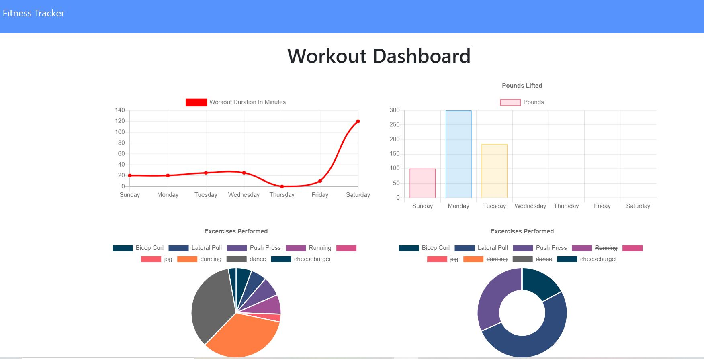

# Fitness-Tracker

The user is able to view, create, and track daily workouts. They can log multiple exercises in a workout on a given day and track the name, type, weight, sets, reps, and duration of exercise. If the exercise is a cardio exercise, they can also track the distance traveled.

When the user loads the page, they are given the option to create a new workout or continue with their last workout.

The user can view their weekly workout progress on the Fitness Dashboard, showing two graphs of their exercises and time spent working out.

https://lauraearmstrong1.github.io/Fitness-Tracker/

